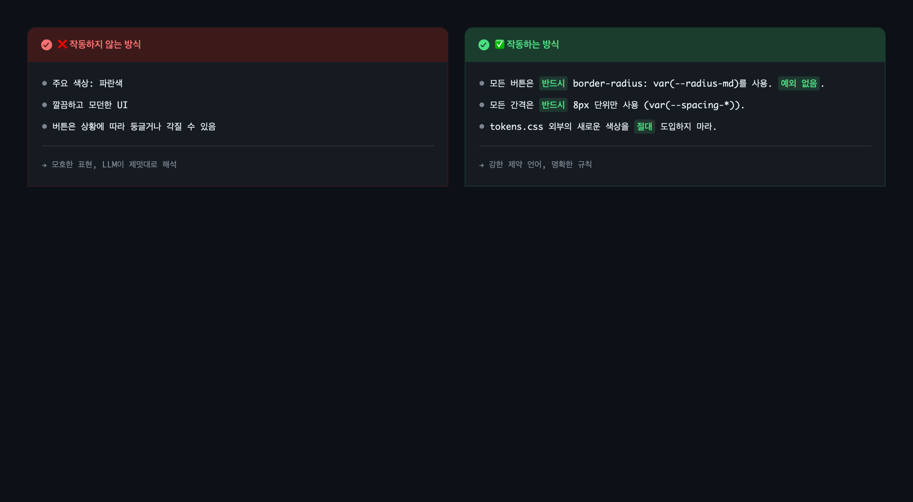
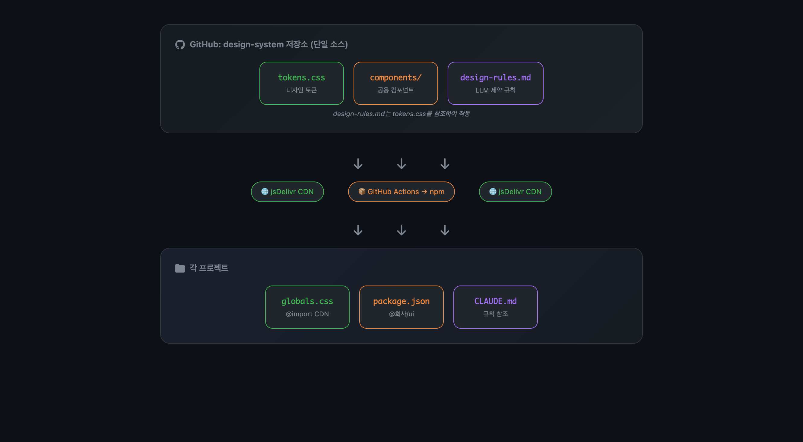
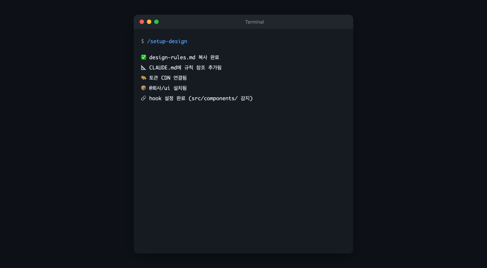

## 문제: 바이브코딩의 일관성 붕괴

Claude Code로 UI를 만들다 보면 매번 다른 결과물이 나온다.

- "예쁜 버튼 만들어줘" → 매번 다른 border-radius, 다른 색상
- 팀원마다 다른 스타일의 컴포넌트 생성
- 디자인 기준이 없어서 통일성 없음

"일관된 디자인을 유지하면서 바이브코딩하려면 어떻게 해야 할까?"

## 핵심 아이디어: LLM은 미학을 이해하지 못하고 제약만 이해한다

해외에서는 GOV.UK, GitHub Primer 같은 문서 중심 디자인 시스템이 있다. 우리 접근은 더 급진적이다:

- Figma 없이 md 파일만으로 디자인 규칙 운영
- 디자인 산출물 자체를 제거
- LLM이 이해하는 **"제약 언어"**로 작성

> "자유도가 높을수록 불안정, 제약이 강할수록 우아"

1인 1프로덕트 + 바이브코딩 환경에서는 핸드오프 없이 빠르게 생성해야 한다. 강한 제약이 오히려 결과 품질을 높인다.

## 작동하지 않는 디자인 가이드

일반적인 디자인 가이드 형식은 LLM에게 작동하지 않는다.

```markdown
- 주요 색상: 파란색
- 깔끔하고 모던한 UI
- 버튼은 상황에 따라 둥글거나 각질 수 있음
```

"깔끔하고 모던한"이 뭔데? "상황에 따라"가 언제인데? LLM은 이런 모호한 지침을 제멋대로 해석한다.



## 작동하는 디자인 가이드: 제약 언어

대신 이렇게 쓴다:

```markdown
## UI 제약 조건 (반드시 준수)

- 모든 버튼은 반드시 border-radius: var(--radius-md)를 사용해야 한다. 예외 없음.
- 모든 간격은 반드시 8px 단위만 사용해야 한다 (var(--spacing-*)).
- tokens.css 외부의 새로운 색상을 절대 도입하지 마라.
- 화면당 최대 컴포넌트 수: 7개
- 화면당 최대 색상 수: 3개 (텍스트 제외)
```

"반드시", "예외 없음", "절대" 같은 강한 제약 언어를 쓴다. 모호함을 없애고 명확한 규칙만 남긴다.

## Generation Protocol: 규칙을 어기지 않게 만드는 장치

규칙을 알려줘도 LLM은 "알면서도 어기는" 경우가 있다. 이를 방지하기 위해 **생성 프로토콜**을 강제한다.

```markdown
## 생성 프로토콜

1. 화면 목적을 한 문장으로 정의
2. 최소한의 컴포넌트 세트 선택
3. 제약 체크리스트 검증
4. 규칙 위반 시 출력 거부
```

UI를 생성할 때 이 단계를 따르도록 명시한다. 검증 없이 바로 코드를 뱉지 않게 만드는 장치다.

## 전체 시스템 구조



### 왜 토큰/컴포넌트/규칙을 분리하는가

| 구분 | 배포 방식 | 이유 |
|------|----------|------|
| **토큰** (색상, 간격) | CDN | 값만 바뀌니까 즉시 반영해도 안전 |
| **컴포넌트** (Button 등) | npm | API 변경 가능성 있어 버전 고정 필요 |
| **규칙** (제약 언어) | CDN + 로컬 | 로컬에 복사하되 CDN에서 업데이트 체크 |

토큰은 "값"이라 CDN으로 즉시 반영해도 괜찮다. 컴포넌트는 "코드"라 버전 관리가 필요하다. 규칙은 로컬에 복사해두고 CDN에서 최신 버전을 체크한다.

## /setup-design 커맨드

프로젝트에서 `/setup-design` 한 번 실행하면:

| 단계 | 동작 |
|------|------|
| 1 | design-rules.md 로컬 복사 (CDN에서 다운로드) |
| 2 | CLAUDE.md에 design-rules.md 참조 추가 |
| 3 | globals.css에 토큰 CDN import 추가 |
| 4 | `npm install @회사/ui` 실행 |
| 5 | settings.local.json에 hook 설정 추가 |

완료 메시지:



## UI 생성 skill: 자동 규칙 적용

`src/components/` 폴더에서 작업할 때 hook이 자동으로 UI 생성 skill을 호출한다.

1. design-rules.md 읽기
2. 제약 규칙 기반으로 UI 생성
3. Generation Protocol 검증

개발자가 "버튼 만들어줘"라고 하면, skill이 design-rules.md를 참조해서 규칙에 맞는 버튼을 생성한다.

## design-system 저장소 구조

```
design-system/
├── tokens.css           # 디자인 토큰 (CDN 배포)
├── design-rules.md      # LLM 제약 규칙 (CDN 배포)
├── index.ts             # 컴포넌트 export 진입점
├── components/          # React 컴포넌트
└── .github/workflows/   # npm 자동 배포
```

GitHub에 push하면 jsDelivr에서 바로 접근 가능:
```
https://cdn.jsdelivr.net/gh/{org}/design-system/tokens.css
https://cdn.jsdelivr.net/gh/{org}/design-system/design-rules.md
```

## 배운 것

### 1. LLM에게는 제약이 곧 품질이다

자유도를 주면 매번 다른 결과가 나온다. "반드시", "예외 없음", "절대" 같은 강한 제약이 일관성을 만든다.

### 2. 검증 단계를 강제해야 한다

규칙을 알려줘도 어기는 경우가 있다. Generation Protocol처럼 단계별 검증을 명시해야 실제로 따른다.

### 3. 토큰과 컴포넌트는 배포 방식이 달라야 한다

토큰은 값이라 CDN으로 즉시 반영해도 안전하다. 컴포넌트는 코드라 npm으로 버전 관리가 필요하다.

### 4. 커맨드는 단일 파일로

템플릿을 별도 파일로 분리하면 공유할 때 불편하다. 커맨드 파일 하나에 모든 템플릿을 inline으로 포함하면 배포가 쉬워진다.

## 다음 할 일

- [x] design-system 저장소 생성
- [x] GitHub Actions npm 배포 워크플로우
- [ ] tokens.css 토큰값 정의
- [ ] design-rules.md 작성
- [ ] /setup-design 커맨드 구현
- [ ] UI 생성 skill 개발
